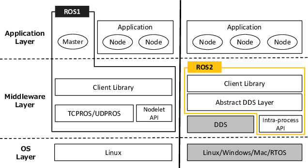

These are my notes from working through ROS 2 Humble, from command-line tools and node communication to launch files, TF2, URDF, RViz, and testing. I wrote them to connect the individual concepts before applying them to Unity and robot simulation.

# Understanding the Basics
## ROS (Robot Operating System)
ROS 2 is a collection of software libraries and tools for building modular robot systems. It provides common patterns for communication, control, and simulation, and uses DDS (Data Distribution Service) for distributed communication between processes and machines.



The communication diagrams below are conceptual references from the ROS 2 Foxy documentation; my practice environment was ROS 2 Humble.

## Node

A node is a unit of computation in ROS 2. A node can read sensor data, process images, or issue motor commands, while standardized interfaces let separate nodes exchange information.

## Topic

Topics are data channels between nodes. They support one-to-many and many-to-many communication, which is useful for streams such as sensor readings or control commands. ROS 2 distributes each published message to the relevant subscribers.

## Parameter
Parameters are configurable values stored by a node. They can be used to adjust settings such as a robot’s speed limit or sensor threshold without changing the node’s source code.

## Service

A service uses a request–response pattern and is best for short operations that need a returned result, such as resetting a simulation, querying a map, or changing a mode. Services use `.srv` files to define their request and response format.

## Action

Actions extend the idea of services by supporting long-running tasks with continuous feedback. Navigation is a typical example: you send a goal, receive progress updates, and eventually get a result. The `.action` file describes this three-part structure.

## Interface
ROS 2 defines three interface types for communication:
- `.msg` → basic message structures  
- `.srv` → service (request/response)  
- `.action` → long-running actions with feedback  

These interfaces ensure consistent communication across nodes, packages, and even different programming languages.

## Launch
Launch files start related nodes, parameters, remappings, and configuration together instead of requiring a separate command for each component.

## Composition
Node composition lets multiple nodes run inside a single process. It can reduce communication and memory overhead when several compatible components need to exchange data frequently.

## Executor
Executors determine how callbacks are processed:
- **Single-threaded executor** — each callback runs sequentially  
- **Multi-threaded executor** — callbacks may run in parallel  

Understanding executors helps explain when callbacks run and why their timing can change.

---

# Materials
This is the setup I used for these ROS 2 notes:

- Ubuntu 22.04  
- [Official ROS 2 Humble documentation](https://docs.ros.org/en/humble/index.html)  
- YouTube video tutorials  
- Visual Studio Code (C++ / Python)  
- Additional tools:
    - **Turtlesim** for basic concepts  
    - **Gazebo** for simulation  
    - **RViz 2** for visualization  

---

# Practice Notes

## Beginner: CLI Tools
Before writing code, I used the command-line tools to observe how nodes, topics, services, and actions behave in a running ROS 2 system.

### What you learn here
- Inspecting active nodes with `ros2 node list`
- Checking published and subscribed topics with `ros2 topic list`
- Echoing data streams using `ros2 topic echo`
- Calling services directly through CLI
- Visualizing architecture using `rqt_graph`
- Basic debugging with `ros2 doctor` and `ros2 info`

I initially underestimated this step, but the CLI commands became useful when I started debugging multi-node systems.

---

## Beginner: Client Libraries (Python & C++)
The next step was building packages with `colcon`: creating a workspace and `src/` folder, adding packages, writing nodes, and rebuilding the workspace after changes.

### 1. Creating Packages
You learn to generate packages using:
```bash
ros2 pkg create my_pkg --build-type ament_cmake
```

or Python packages via:

```bash
ros2 pkg create my_pkg --build-type ament_python
```

This automatically sets up the directory structure, `package.xml`, and build files.

### 2. Publisher & Subscriber

Writing a minimal publisher/subscriber pair helped me practice:

* message imports
* QoS (Quality of Service) basics
* callback structures
* timers

This exercise connected message definitions, callbacks, timers, and QoS in one small example.

### 3. Services & Clients

Here you write synchronous communication in both languages. You define `.srv` files, build interfaces, and implement request–response handlers.

### 4. Custom Interfaces

You define your own `.msg` and `.srv` structures.
This part forces you to think about architecture instead of dumping arbitrary data.

### 5. Parameters

ROS 2 parameters allow you to:

* load parameters from YAML
* override them via CLI
* declare dynamic parameters
* handle parameter callbacks

I used this section to practice loading settings from YAML and changing values from the command line.

---

## Intermediate: Advancing with ROS 2

This section connects the earlier communication concepts with dependencies, actions, composition, launch files, transforms, testing, and robot models.

---

### Working With Dependencies

Before building a ROS 2 package, its dependencies need to be resolved.
`rosdep` handles this by scanning `package.xml` and installing missing system libs.

```bash
rosdep install --from-paths src -y --ignore-src
```

Missing dependencies were a recurring cause of build failures in my practice, so I added this check to my normal workflow.

---

### Actions

Actions are designed for longer-running goals that need feedback, cancellation, and a final result. An `.action` file defines:

* Goal
* Result
* Feedback

Then you implement action servers and clients in both Python and C++.
Navigation stacks and manipulation frameworks rely heavily on actions.

---

### Composable Nodes

This section covers loading multiple compatible components into one process.
Instead of launching each node as a separate process, you load multiple nodes into a single shared process.

**Potential benefits:**

* lower latency (no process-to-process overhead)
* reduced memory consumption
* faster communication

The benefit depends on the components and workload, so it should be measured for a specific system.

---

### Node Interfaces & Dynamic Parameters

This covers more advanced techniques like:

* introspecting node interfaces
* reacting to parameter updates
* using templates and advanced C++ patterns

This helped me understand how a node exposes information and responds to configuration changes.

---

### Launch Files (Python / XML)

Launch files become more complex here:

* multiple nodes
* namespaces
* remapping
* events and lifecycle management
* conditional execution
* passing parameters to nodes automatically

The launch file defines how the related parts of the system start together.

---

### TF2 (Transforms)

TF2 manages coordinate transforms between frames in a ROS 2 system.

You learn:

* broadcasting transforms
* listening and chaining transforms
* using TF buffers
* visualizing frames in RViz

Understanding TF2 is crucial for anything involving sensors or movement.

---

### Testing (Unit & Integration)

ROS 2 supports testing through:

* GTest for C++
* pytest for Python
* `launch_testing` for integration tests

Automated tests provide a repeatable way to check individual nodes and multi-node launch behavior after changes.

---

### Robot Modeling (URDF) & Visualization

URDF (Unified Robot Description Format) is used to model robot links and joints.
You visualize it in RViz and integrate it with Gazebo simulation.

This stage connects the earlier concepts by visualizing a robot model and its motion before using physical hardware.

---

# Debugging Notes

Some common issues I noted while building ROS 2 projects:

* Missing dependencies (fix with `rosdep install`)
* Incorrect package paths
* Misconfigured CMakeLists or package.xml
* Build failures caused by unsaved files
* Gazebo version conflicts
* RViz plugin issues
* Wrong QoS causing subscriber to receive no messages

Debugging ROS 2 is an ongoing part of the workflow.
