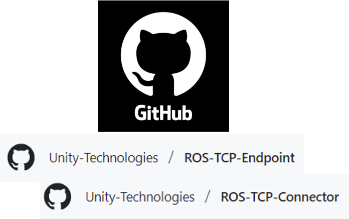
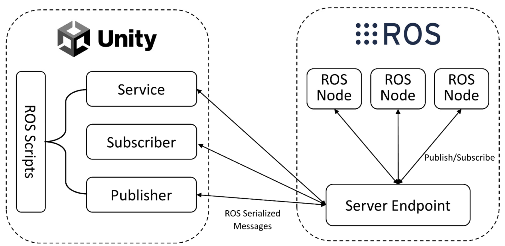
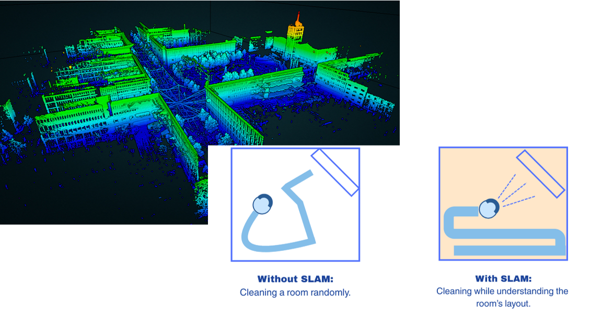
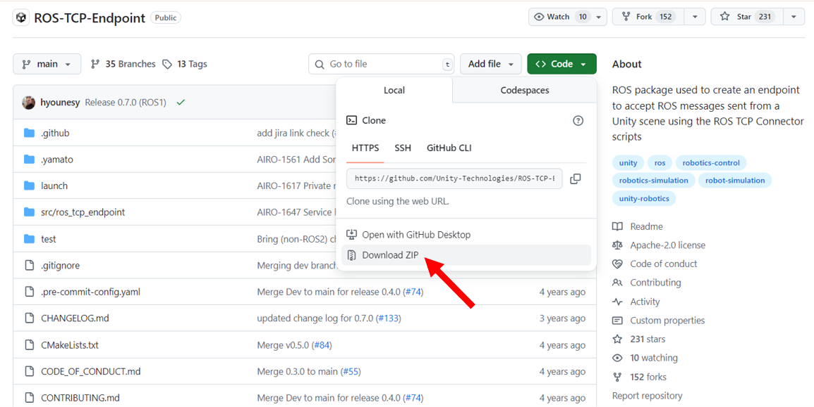
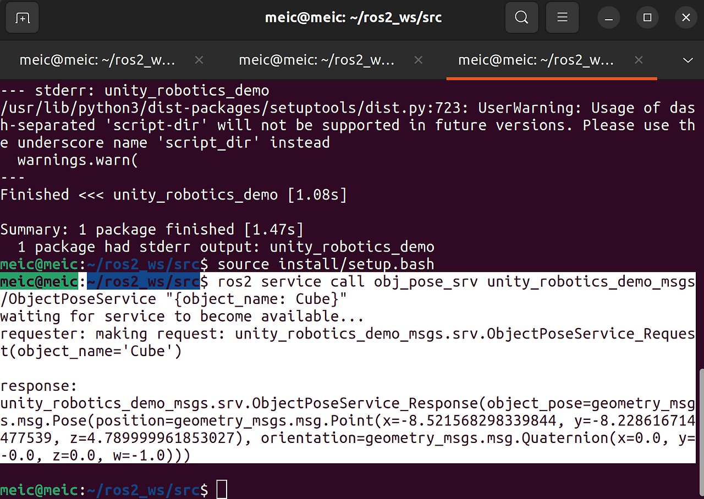

I used the **ROS-TCP Endpoint and Connector** to exchange data between ROS 2 Humble and Unity. This build log records how I configured the bridge, tested messages and services, and used the connection for navigation, visualization, and SLAM experiments in a simulated environment.  

---

# Understanding the Basics
**ROS TCP Endpoint/Connector**

- **Definition**: A ROS node that enables message passing over TCP between ROS 2 and external systems such as Unity
- **Purpose**: Facilitates real-time communication for robotics simulations and visualizations
- **Example**: A ROS node sends robot position data to Unity, which renders the robot in a 3D environment

**ROS-Unity Communication**

> Image Source: [MDPI](https://www.mdpi.com/1424-8220/24/17/5680)
- **Definition**: The broader process of how ROS 2 and Unity interact, using the TCP Endpoint/Connector to exchange data through topics, services, or actions.
- **Example**: Unity subscribes to a ROS topic (/robot_color) to change a robot’s color, or ROS responds to a Unity service request with a robot’s pose.

**SLAM (Simultaneous Localization & Mapping)**

> Image sources: [Laser Scanning Europe](https://www.laserscanning-europe.com/en/what-slam) and [Kodifly](https://kodifly.com/what-is-slam-a-beginner-to-expert-guide)
- **Definition**: A method for robots to build a map of an unknown environment while tracking their location within it.
- **Applications**: Autonomous navigation, 3D map reconstruction, obstacle avoidance.
- **Example**: A robot uses LiDAR to create a 2D occupancy grid in RViz, which can also be visualized in Unity.

---

# Materials
- [ROS-TCP Endpoint repository](https://github.com/Unity-Technologies/ROS-TCP-Endpoint?tab=readme-ov-file)
- [ROS-TCP Connector repository](https://github.com/Unity-Technologies/ROS-TCP-Connector)
- ROS 2 (I used ROS 2 Humble on Ubuntu 22.04)
- Unity v.2020.2+
- Visual Studio (for C#)
- RViz (for visualization in ROS)

---

# Build Steps
These steps reflect the ROS 2 Humble and Unity setup I used for this experiment.

## Setup
### ROS

1. Download [ROS TCP Endpoint](https://github.com/Unity-Technologies/ROS-TCP-Endpoint?tab=readme-ov-file)
2. From the root of the colcon workspace, source ROS 2, build the workspace, and then source the workspace setup file:
```bash
source /opt/ros/humble/setup.bash
colcon build
source install/setup.bash
```
3. In your colcon workspace, run the following command, replacing `<your IP address>` with your ROS machine’s IP address or hostname.
```bash
ros2 run ros_tcp_endpoint default_server_endpoint --ros-args -p ROS_IP:=192.168.0.5
```

- If you're running ROS in a Docker container, 0.0.0.0 is a valid incoming address, so you can write
  `ros2 run ros_tcp_endpoint default_server_endpoint --ros-args -p ROS_IP:=0.0.0.0`
- On Linux you can find out your IP address with the command `hostname -I`
- On macOS, you can find your IP address with `ipconfig getifaddr en0`.

---
Once the server endpoint has started, it will print something similar to `[INFO] [1603488341.950794]: Starting server on 192.168.50.149:10000`.
To use a different port, set `ROS_TCP_PORT` as well:
```bash
ros2 run ros_tcp_endpoint default_server_endpoint --ros-args -p ROS_IP:=127.0.0.1 -p ROS_TCP_PORT:=10000
```

### Unity 
1. Open the Package Manager (`Window > Package Manager`).
2. Click the `+` button in the upper-left corner and select `Add package from Git URL…`.
3. Enter the Git URL for the package.
4. For the ROS-TCP-Connector, enter `https://github.com/Unity-Technologies/ROS-TCP-Connector.git?path=/com.unity.robotics.ros-tcp-connector`.
- Optional: for visualization tools, enter `https://github.com/Unity-Technologies/ROS-TCP-Connector.git?path=/com.unity.robotics.visualizations`.
5. Click `Add`.
6. Open `Robotics → ROS Settings` from the Unity menu bar and set the ROS IP Address to the value used earlier. For a local Docker setup, the default may remain `127.0.0.1`.
7. In the ROS Settings window, set the protocol to ROS 2.

## ROS Unity Integration
### Publisher
<iframe width="100%" height="468" src="https://www.youtube.com/embed/oeHS8G2DeYs" title="Unity to ROS 2 publisher test" frameborder="0" allow="accelerometer; autoplay; clipboard-write; encrypted-media; gyroscope; picture-in-picture; web-share" allowfullscreen></iframe>

> Unity publishes data (e.g., robot position coordinates) to a ROS 2 topic, which a ROS subscriber receives.

**Concept**: Unity can act as a Publisher, sending data continuously to a ROS topic.
**Typical Use Case**: Streaming an object’s position, velocity, or any sensor-like data from Unity to ROS.
**Unity Side**: You use the ROSConnection component to define the topic and message type, then call Publish() inside a Unity script.
**ROS Side**: A ROS node subscribes to the same topic to consume Unity’s data.

### Subscriber
<iframe width="100%" height="468" src="https://www.youtube.com/embed/TqKIByLq1NI" title="ROS 2 to Unity subscriber test" frameborder="0" allow="accelerometer; autoplay; clipboard-write; encrypted-media; gyroscope; picture-in-picture; web-share" allowfullscreen></iframe>

> ROS 2 publishes a topic that changes the color, and Unity subscribes to that topic to update the object.

**Concept**: Unity can also subscribe to ROS topics and react when messages arrive.
**Typical Use Case**: ROS publishes sensor data or control commands, and Unity updates its simulation accordingly (e.g., changing color, triggering animations).
**Unity Side**: In Unity, you register a callback for a topic using Subscribe<T>().
**ROS Side**: A ROS node publishes messages to that topic.

### Service

> Unity (the service client) requests an object’s pose.
> ROS (Service Server) calculates its pose and responds to Unity.

**Concept**: A service uses a request–response pattern rather than a continuous stream.
**Typical Use Case**: When Unity needs a precise answer at a specific moment.
**Unity as Service Client**: Unity sends a request, e.g., “What’s the pose of this object?”
**ROS as Service Server**: ROS computes the answer and returns it.

### Service Call
<iframe width="100%" height="468" src="https://www.youtube.com/embed/Jf0TovLSnvA" title="Repeated ROS 2 service-call test in Unity" frameborder="0" allow="accelerometer; autoplay; clipboard-write; encrypted-media; gyroscope; picture-in-picture; web-share" allowfullscreen></iframe>
  1. Start at current position
  2. Move toward destination
  3. Near target → Request update from ROS
  4. Get new destination
  5. Repeat

**Concept**: A Service Call can be repeated in sequence to drive a process step by step.
**Typical Use Case**: Unity moves an object toward a goal. Once near the target, Unity requests a new goal from ROS, receives it, and continues.

> In this experiment, I used topics for continuously changing state and services for individual requests that needed a returned value.

## Robotics Nav2 and SLAM Example
<iframe width="100%" height="468" src="https://www.youtube.com/embed/atLGOWf3JpI" title="Nav2 and SLAM example setup" frameborder="0" allow="accelerometer; autoplay; clipboard-write; encrypted-media; gyroscope; picture-in-picture; web-share" allowfullscreen></iframe>

<iframe width="100%" height="468" src="https://www.youtube.com/embed/IOTopMyFSew" title="Nav2 and SLAM visualization in Unity" frameborder="0" allow="accelerometer; autoplay; clipboard-write; encrypted-media; gyroscope; picture-in-picture; web-share" allowfullscreen></iframe>

### Repository Setup
I cloned the [Nav2 SLAM Example](https://github.com/Unity-Technologies/Robotics-Nav2-SLAM-Example/tree/main) and moved to its ROS 2 workspace. The repository’s README contains the build and launch commands for the selected environment.
```bash
git clone https://github.com/Unity-Technologies/Robotics-Nav2-SLAM-Example.git
cd Robotics-Nav2-SLAM-Example/ros2_docker/colcon_ws
```

### Visualization & Custom Visualizer
DefaultVisualizationSuite includes:
- GoalPose → Robot position (topic-based).
- OccupancyGridVisualizer → SLAM map.
- LaserScanSensor → LiDAR scan.

I added the following script to the Unity project for a custom visualization.

```csharp
using System;
using System.Collections.Generic;
using RosMessageTypes.Geometry;                     // Generated message classes
using Unity.Robotics.Visualizations;                // Visualizations
using Unity.Robotics.ROSTCPConnector.ROSGeometry;   // Coordinate space utilities
using UnityEngine;

public class PoseTrailVisualizer : HistoryDrawingVisualizer<PoseStampedMsg>
{
    [SerializeField]
    Color m_Color = Color.white;
    [SerializeField]
    float m_Thickness = 0.1f;
    [SerializeField]
    string m_Label = "";

    public override Action CreateGUI(IEnumerable<Tuple<PoseStampedMsg, MessageMetadata>> messages)
    {
        return () =>
        {
            var count = 0;
            foreach (var (message, meta) in messages)
            {
                GUILayout.Label($"Goal #{count}:");
                message.pose.GUI();
                count++;
            }
        };
    }

    public override void Draw(Drawing3d drawing, IEnumerable<Tuple<PoseStampedMsg, MessageMetadata>> messages)
    {
        var firstPass = true;
        var prevPoint = Vector3.zero;
        var color = Color.white;
        var label = "";

        foreach (var (msg, meta) in messages)
        {
            var point = msg.pose.position.From<FLU>();
            if (firstPass)
            {
                color = VisualizationUtils.SelectColor(m_Color, meta);
                label = VisualizationUtils.SelectLabel(m_Label, meta);
                firstPass = false;
            }
            else
            {
                drawing.DrawLine(prevPoint, point, color, m_Thickness);
            }

            prevPoint = point;
        }

        drawing.DrawLabel(label, prevPoint, color);
    }
}
```

---

# Errors
## ROS Errors
**Colcon Build**
- Wrong package name: ROS-TCP-Endpoint-main → ros_tcp_endpoint
- Wrong build location: colcon build inside Robotics-Nav2-SLAM-Example → Robotics-Nav2-SLAM-Example/ros2_docker/colcon_ws

**Not Connected to Unity**
- The ROS and Unity machines were on different networks.
- The ROS IP address in Unity did not match the endpoint.

## Unity Errors
**`DeserializationException: Cannot deserialize message`**
- Regenerate and rebuild the ROS message classes.
