I built a small passthrough prototype on Meta Quest 3 to test virtual objects inside a scanned room. The scene lets me spawn and throw balls, then observe how they collide with real-world walls and floors. This is a build log of the setup, the problems I encountered, and what I learned from the experiment.

# Understanding the Basics
Before jumping into Unity, I clarified the essential concepts.
- **Mixed Reality (MR)**: blends virtual content with the real world.
- **Extended Reality (XR)**: umbrella term for VR, AR, and MR.
- **Passthrough**: lets you see the real world through the Quest's cameras, layered with virtual objects.

💡*Why this matters*: MR is not just "turn on a camera." Understanding this early saves time when configuring cameras, layers, and interactions in Unity.

# Tools
- Unity 2020.3 LTS
- Meta Quest 3
- USB-C cable for device builds
- [Oculus Integration](https://assetstore.unity.com/packages/tools/integration/oculus-integration-deprecated-82022?srsltid=AfmBOoqs3VykViopb9qVxMb3gFcYp88tIxOFRBEoxyUs_zHPXRYparKT) package from the Unity Asset Store (legacy setup)

I used the Unity 2020.3 LTS release family for this experiment. These notes reflect that Oculus Integration setup, so package names and configuration screens may differ in other Unity versions.

---

# Build Steps
## Setup
### 1. Enable Developer Mode

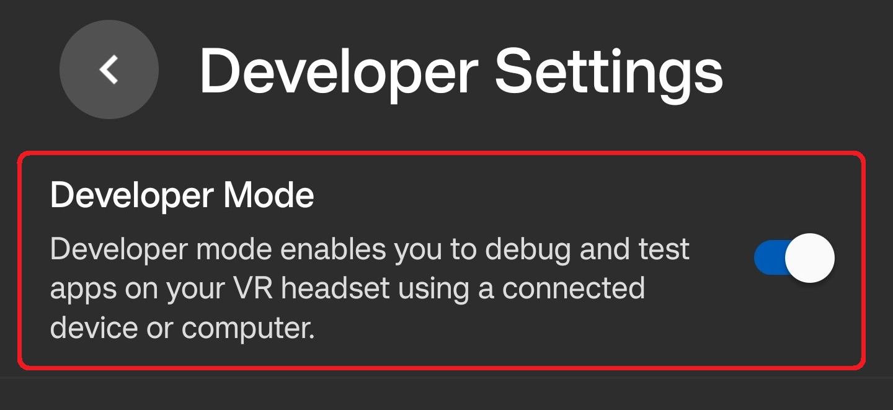

- Create a **Meta Developer Account** in [Meta](https://developers.meta.com/horizon/sign-up/).
- Turn on **Developer Mode** in the Meta Horizon app.


### 2. Setting Up Unity for Oculus Development

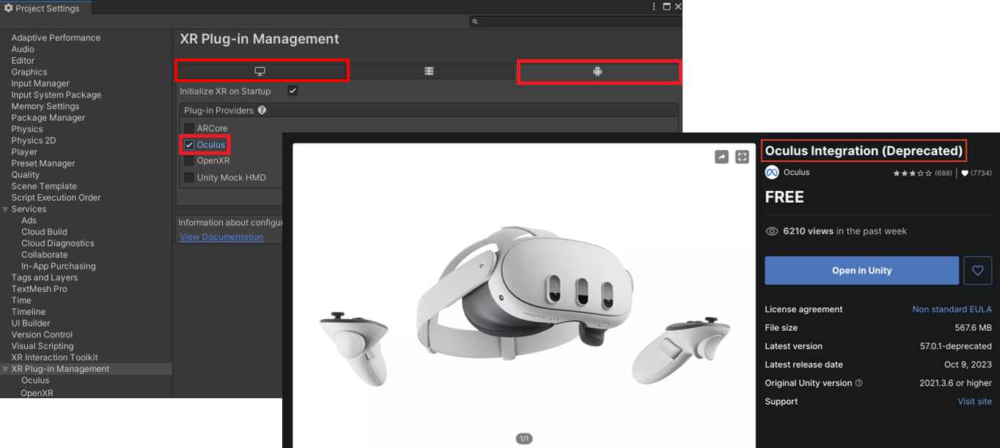

- Go to `Edit → Project Settings → XR Plug-in Management`, enable **Oculus** for both Windows and Android.
- Install [**Oculus Integration**](https://assetstore.unity.com/packages/tools/integration/oculus-integration-deprecated-82022?srsltid=AfmBOoqs3VykViopb9qVxMb3gFcYp88tIxOFRBEoxyUs_zHPXRYparKT) from the Unity Asset Store.
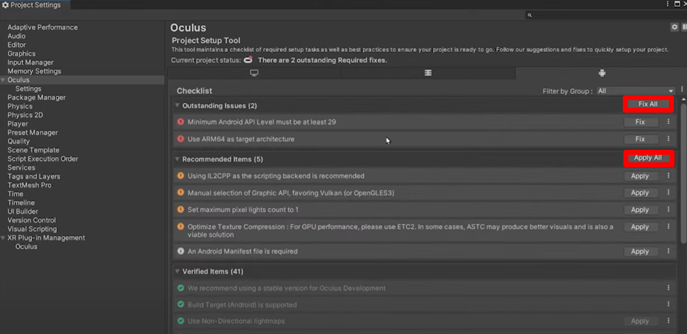
- Run `Tools → Project Setup Tool → Fix All & Apply All`. This resolved several configuration warnings in my project.
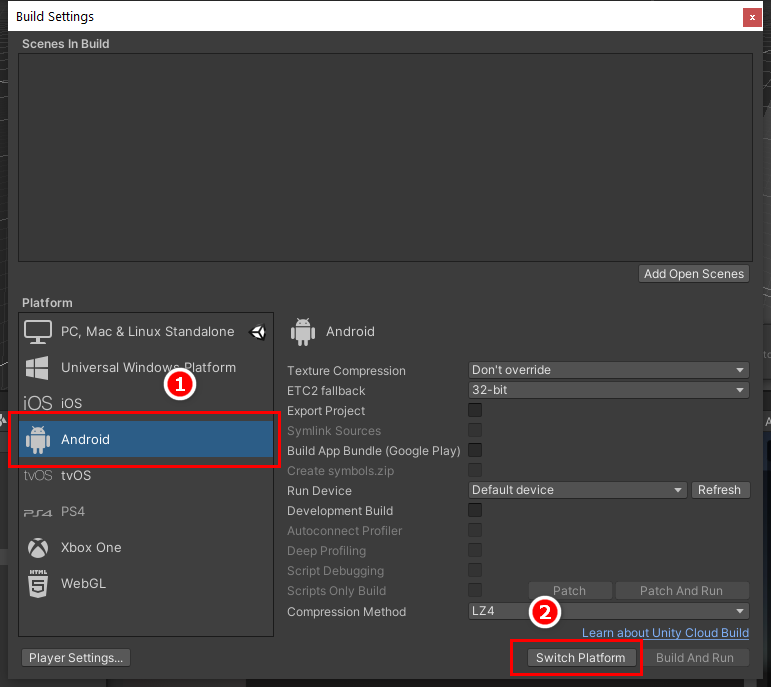
- **Switch platform** in `File → Build Settings → Android`.

💡 Why:
Quest 3 runs Android, and this setup needs both the XR plug-in and Oculus package. My first test build displayed nothing until those project settings were corrected.

---

## Connecting the Headset & Building
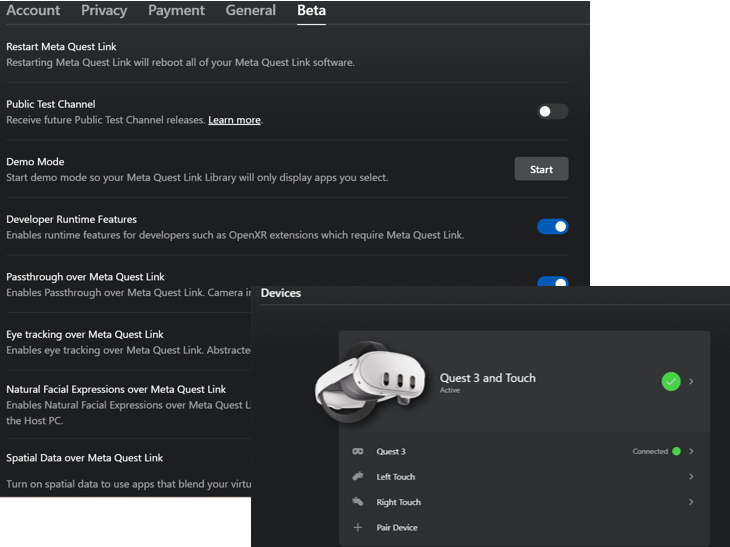
### Method 1: **Air Link (Wireless)**
This was convenient, but my tests had slightly blurrier visuals and longer load times.

- Turn on Developer settings in Quest (Settings → Beta)
- Connect Quest to the PC through Air Link.
- Run from Unity. (May cause longer load times)

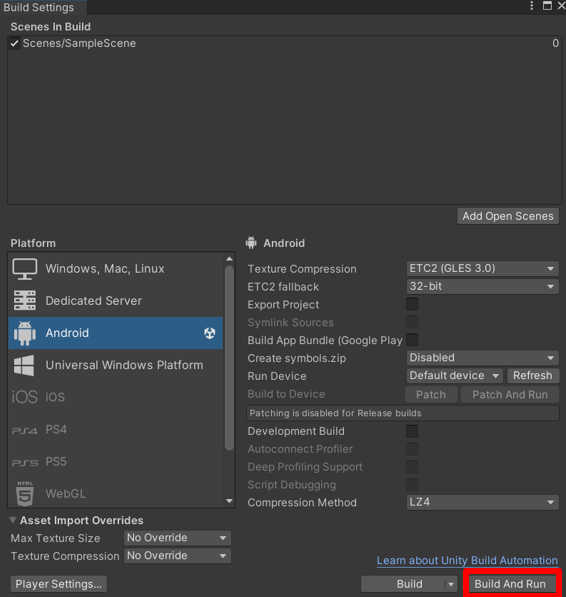
### Method 2 (Recommended): **USB-C (Wired)** 
This produced more stable connections and faster device builds in my tests.

- Connect Quest via USB-C cable
- In Unity, go to `File → Build Settings` and click **Build and Run**.

---

## Passthrough
### 1. Camera Configuration
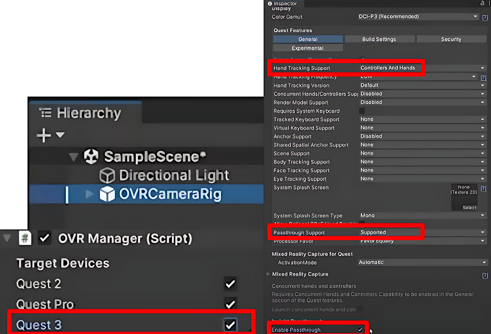
- Delete the default `Main Camera`.
- Add `OVRCameraRig` prefab.
- In `OVRManager` (inside OVRCameraRig), set:
    - Hand Tracking Support → “Controllers and Hands”
    - Passthrough Support → “Supported”
    - Enable Passthrough → Checked
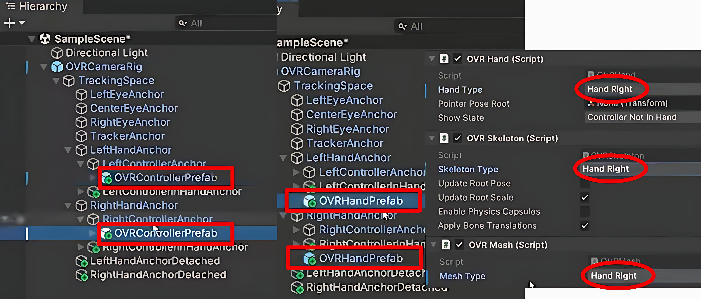
- Add `OVRControllerPrefab` and `OVRHandPrefab` to Right/LeftHandAnchor.
- On `RightHandPrefab`, set the hand to Right in the `OVRHand`, `OVRSkeleton`, and `OVRMesh` components.

💡 Why:
For this setup, I replaced the default `Main Camera` with `OVRCameraRig`, which handles stereo rendering, tracking, and device input. The `OVRManager` settings enable passthrough and input from controllers or hands. `OVRControllerPrefab` and `OVRHandPrefab` provide visible models for testing those interactions in MR.

### 2. Adding the Passthrough Layer
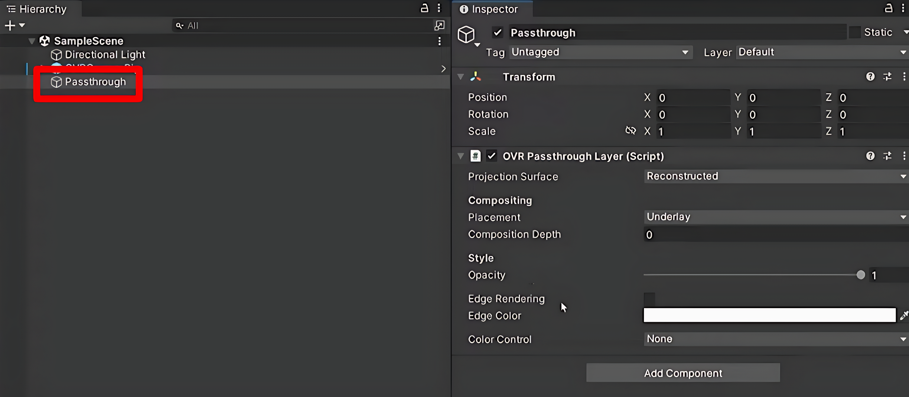
- Create an empty object `Passthrough`.
- Reset its Transform.
- Add **OVR Passthrough Layer** component inside Passthrough.
- Change **Placement → Underlay**.

💡 Why:
Underlay makes the real-world view sit behind virtual objects, avoiding weird overlaps.

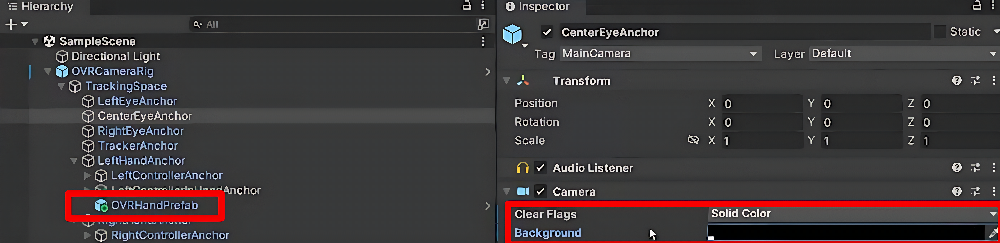
- In `CenterEyeAnchor`, set Clear Flags to **Solid Color** and the background to **black**.
- Create a 3D `Cube` in the Hierarchy and adjust its position as needed.

💡 Why:
The solid black background prevents Unity’s default skybox from showing through. The cube provides a quick check that passthrough and virtual rendering are working together.


## Passthrough Test Video
<iframe width="100%" height="468" src="https://www.youtube.com/embed/DnNl0YZpAPk" title="Passthrough Video" frameborder="0" allow="accelerometer; autoplay; clipboard-write; encrypted-media; gyroscope; picture-in-picture; web-share" allowfullscreen></iframe>

---

## Scan Space
### 1. OVR Settings
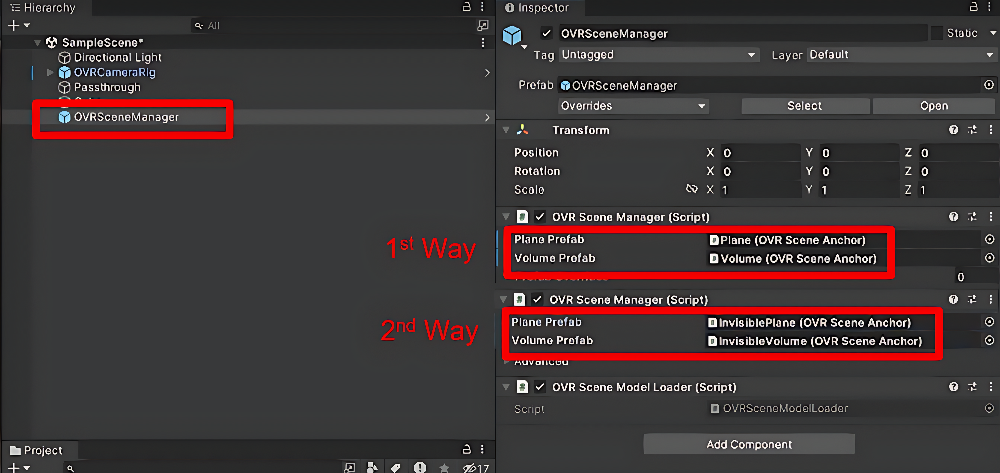
- Add `OVRSceneManager`.
    1. Assign **Plane (OVR Scene Anchor)** to *Plane Prefab* and **Volume (OVR Scene Anchor)** to *Volume Prefab* (plane mesh & volume).
    2. Assign **Invisible Plane (OVR Scene Anchor)** to *Plane Prefab* and **Invisible Volume (OVR Scene Anchor)** to *Volume Prefab* (plane mesh & volume). — *recommended*.
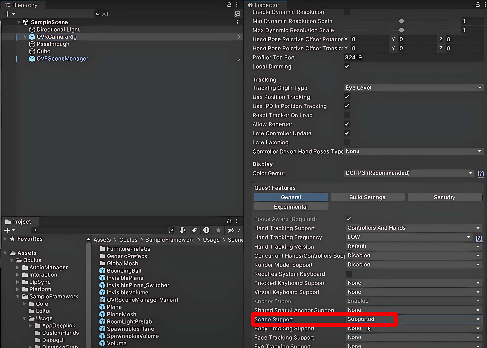
- In `OVRCameraRig`, set `Scene Support` to **Supported**.

💡 Why: 
The Plane and Volume prefabs in `OVRSceneManager` enable virtual objects to collide with scanned walls and floors. Invisible prefabs keep the room mesh hidden while preserving collisions, and scene support enables the headset’s room scan for this setup.

## Room Scan Video
<iframe width="100%" height="468" src="https://www.youtube.com/embed/sJj2BqZMWRE" title="Scan Space Video" frameborder="0" allow="accelerometer; autoplay; clipboard-write; encrypted-media; gyroscope; picture-in-picture; web-share" allowfullscreen></iframe>

---

## Ball Interaction
### 1. Ball Interaction Script
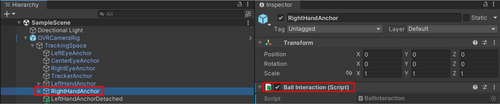
- Go to `RightHandAnchor → Add Component` and create a **BallInteraction** component.
- Paste the following script.
```csharp
using System.Collections;
using System.Collections.Generic;
using UnityEngine;

public class BallInteraction : MonoBehaviour
{
    public GameObject prefab;
    public float spawnSpeed = 5;

    void Update()
    {
        if (OVRInput.GetDown(OVRInput.Button.SecondaryHandTrigger))
        {
            GameObject Ball = Instantiate(prefab, transform.position, Quaternion.identity);
            Rigidbody BallRB = Ball.GetComponent<Rigidbody>();
            BallRB.velocity = transform.forward * spawnSpeed;
        }
    }
}
```

💡 Why: 
This script lets you spawn and throw balls from your right hand trigger.

### 2. Physics
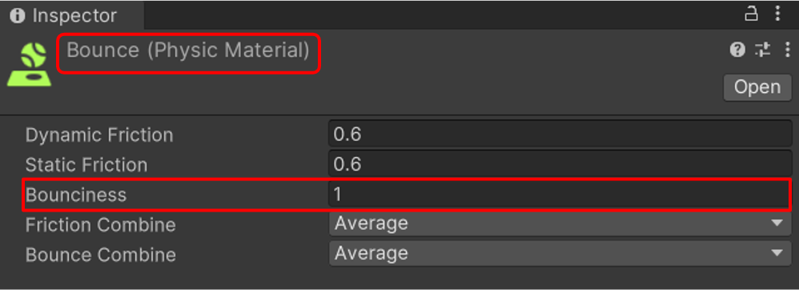
- Create a Physic Material `Bounce` (Bounciness=1) in Assets folder.
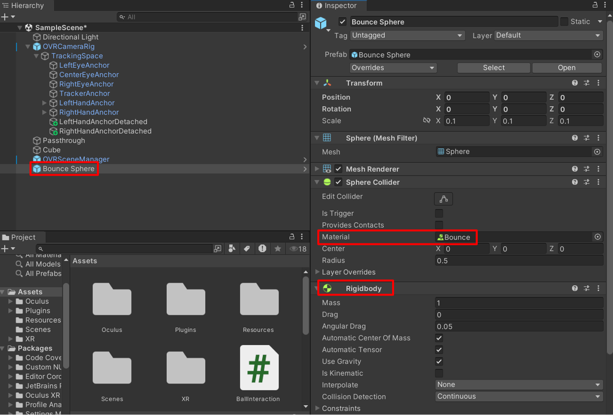
- Create a 3D object sphere `Bounce Sphere` (scale 0.1, 0.1, 0.1) and add **Rigidbody**.
- Go `Bounce Sphere → Sphere Collider → Material` and assign `Bounce`.
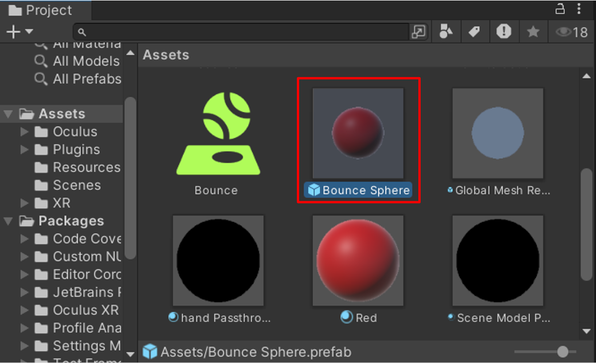
- Save `Bounce Sphere` as a prefab in the Assets folder, then remove the scene instance.
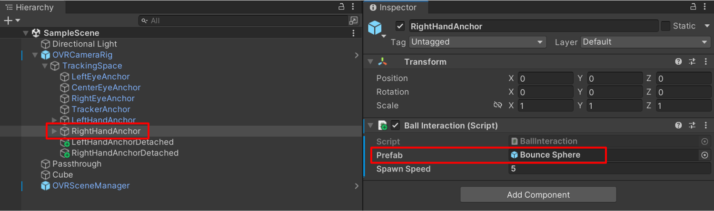
- Go `RightHandAnchor → Ball Interaction → Prefab` and assign `Bounce Sphere`.

💡 Why: 
The Rigidbody and Physics Material make the ball actually bounce instead of rolling lifelessly, and saving it as a prefab keeps spawning clean and reusable.

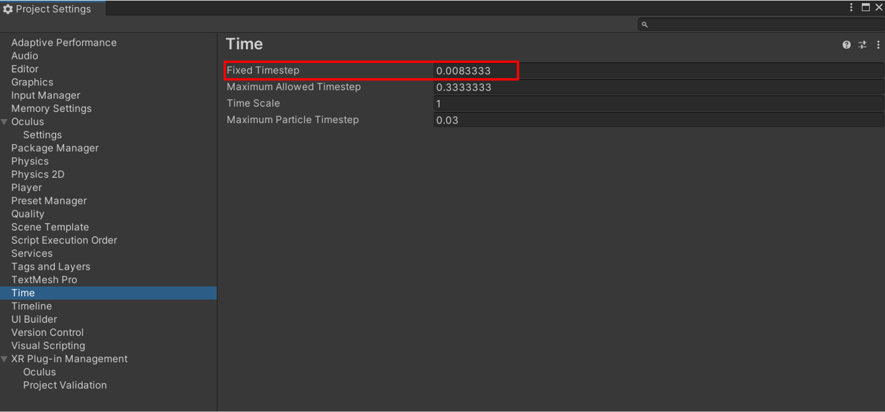
- Go to `Edit → Project Settings → Time` and set **Fixed Timestep = 0.0083333**.


💡 Why: 
This value runs Unity’s physics step at approximately 120 Hz. I used the higher update rate to test whether the moving balls appeared smoother in the headset.

## Ball Interaction Video
<iframe width="100%" height="468" src="https://www.youtube.com/embed/-LsH-tnGQBY" title="Ball Interaction Video" frameborder="0" allow="accelerometer; autoplay; clipboard-write; encrypted-media; gyroscope; picture-in-picture; web-share" allowfullscreen></iframe>

---

# Errors
- Air Link produced blurrier visuals and slower loads in my tests.
- USB builds sometimes took more than 10 minutes.
- Unity sometimes failed to detect the Quest when the headset and computer were on different Wi-Fi networks.

---

# Next Experiments
- Compare collision accuracy in rooms with different scan complexity and furniture layouts.
- Test whether the same room anchors can support stable navigation cues or equipment overlays.

---
