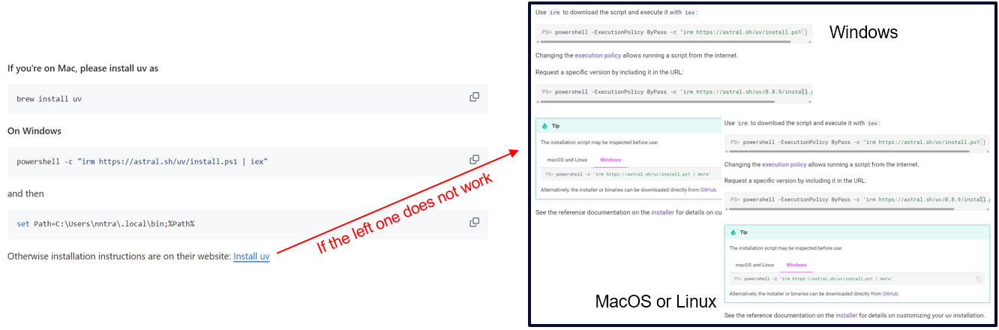
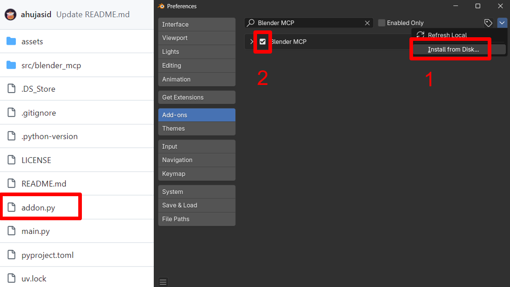
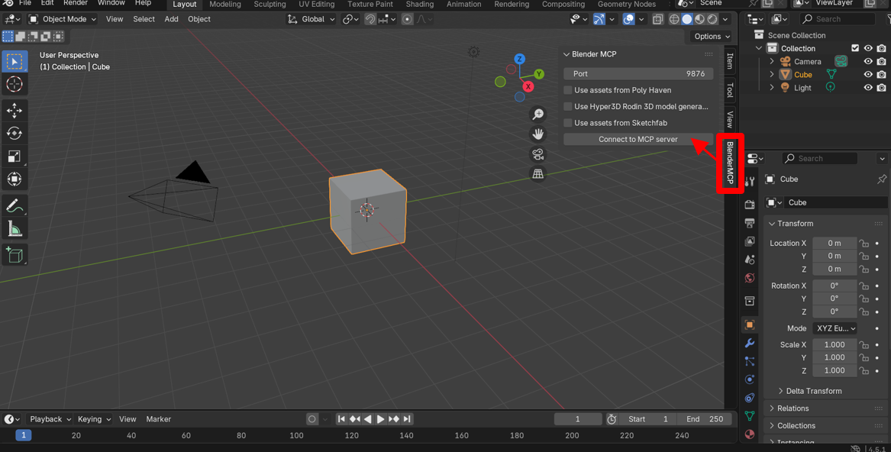
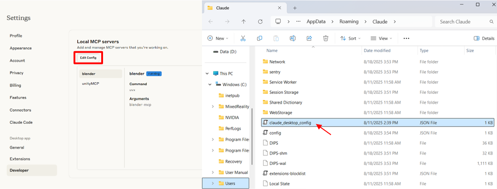
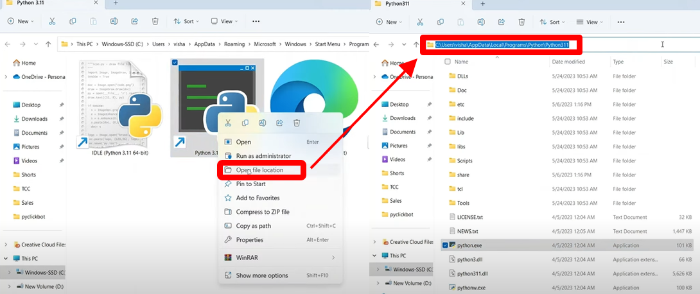
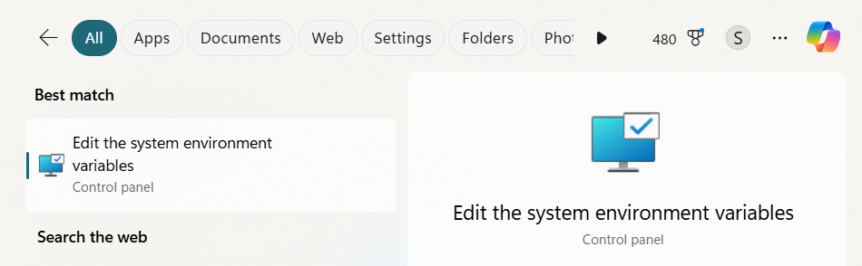
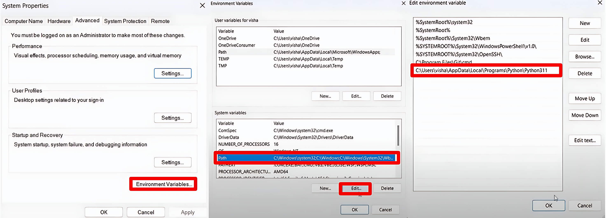
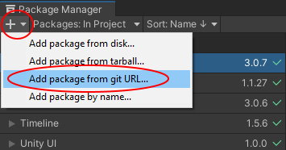
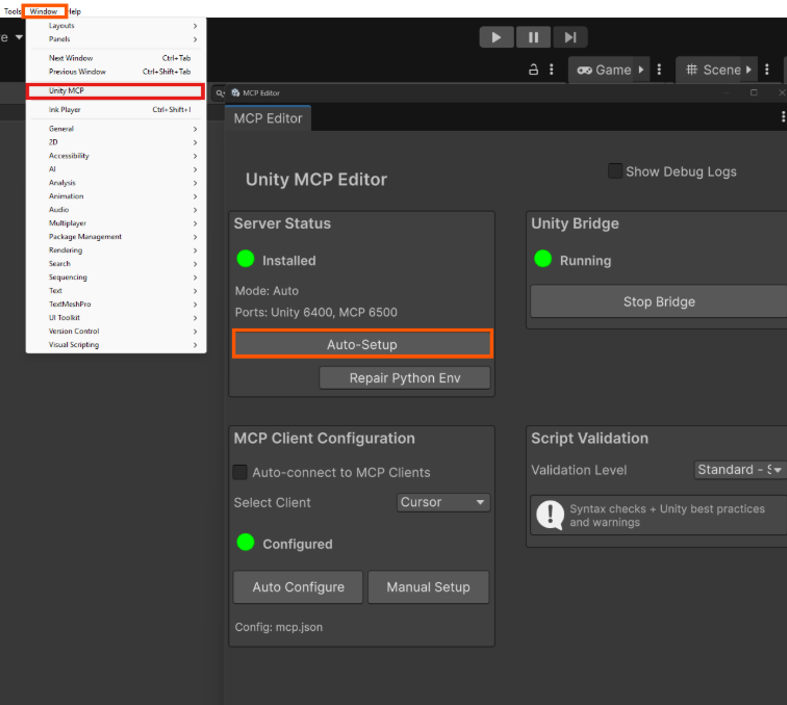

I experimented with **MCP (Model Context Protocol)** to connect Blender and Unity with Claude Desktop. I wanted to see how reliably an AI assistant could inspect and edit a live 3D scene. This note records the setup, what worked, what failed, and the limitations I noticed.

# Understanding MCP
**MCP (Model Context Protocol)** is an open protocol that standardizes how applications talk to large language models (LLMs).  

Key ideas I had to wrap my head around:
- Two-way communication between AI and programs.
- Ability to **create, modify, or delete 3D objects**.
- Editing materials, inspecting entire scenes, and even executing code through the AI.

💡 *Why this matters*: The connection let me test whether an assistant could inspect scene context and make targeted edits inside the tools I was already using.

# Tools & Sources
- **Blender** 3.0+
- **Unity** 6+
- **Python** 3.10+ (Blender MCP), 3.12+ (Unity MCP)
- [Blender MCP GitHub](https://github.com/ahujasid/blender-mcp)  
- [Unity MCP GitHub](https://github.com/CoplayDev/unity-mcp)  
- Claude Desktop
- `uv` package manager

---

# Setup

## `uv` Package Manager
This setup uses `uv` to manage Python dependencies for the MCP servers.  

- Install `uv` using the instructions for the current operating system.
- Confirm the installation with `uv --version` before configuring either tool.

💡 *Why*: 
In this setup, `uv` manages the Python dependencies used by the Blender and Unity MCP servers.


## Blender MCP Setup
### 1. Addon Installation

- Download `addon.py` from the [Blender MCP repository](https://github.com/ahujasid/blender-mcp).
- In Blender, go to `Edit → Preferences → Add-ons`.
- Click **Install from Disk** and select the `addon.py` file.
- Enable the addon by checking the box next to "Interface: Blender MCP".

💡 *Why*: 
The add-on exposes the BlenderMCP controls in the 3D View sidebar and connects the scene to the configured MCP server.


### 2. Blender MCP Tab

- Open the **3D View sidebar** (press `N`).  
- Find the **BlenderMCP** tab.  
- Check *Poly Haven* if you want asset streaming.  
- Click **Connect to Claude**.

💡 *Why*: 
This step links Blender’s scene context to Claude Desktop. I used the connection status and a simple object edit to confirm that it was working.

### 3. Claude Desktop Configuration

- Open **Claude Desktop** and go to `Settings → Developer → Edit Config`.  
- Paste the following code into the `claude_desktop_config` file.
```json
{
  "mcpServers": {
    "blender": {
      "command": "uvx",
      "args": ["blender-mcp"]
    }
  }
}
```
- Restart Claude Desktop.

💡 *Why*: 
This configuration registers the Blender MCP server with Claude Desktop. It took me a few attempts to configure correctly.

### Video
<iframe width="100%" height="468" src="https://www.youtube.com/embed/G4hbDDk09cM" title="Blender MCP setup video" frameborder="0" allow="accelerometer; autoplay; clipboard-write; encrypted-media; gyroscope; picture-in-picture; web-share" allowfullscreen></iframe>

---

## Unity MCP Setup
### 1. Python Path Setup (Windows)

- Locate the Python executable used for this setup and select **Open File Location**.
- Copy the containing folder’s path.

- Open “Edit the system environment variables”.

- Click **Environment Variables**.
- Select `Path` under System variables, then click **Edit**.
- Add the copied folder path.

### 2. Package Installation

- In Unity, open `Window → Package Manager`.  
- Click `+`, then select `Add package from Git URL…`.  
- Paste `https://github.com/CoplayDev/unity-mcp.git?path=/UnityMcpBridge`.
- Click **Add**.

💡 *Why*: This adds the Unity MCP bridge package from its Git repository.

### 3. MCP Auto-Setup

- Go to `Window → Unity MCP`.
- Click Auto-Setup.
- Look for a green status indicator and `Connected`. Auto-Setup attempts to update the MCP client configuration automatically.
- Restart Unity and the MCP client if the connection does not appear immediately.

💡 *Why*: Auto-Setup can update the MCP client configuration without a separate manual JSON edit.

### Video
<iframe width="100%" height="468" src="https://www.youtube.com/embed/Kndy2dcEQU4" title="Unity MCP setup video" frameborder="0" allow="accelerometer; autoplay; clipboard-write; encrypted-media; gyroscope; picture-in-picture; web-share" allowfullscreen></iframe>

---

# Discussion & Reflections
- **Challenges**: MCP requires detailed scene context and precise instructions. Vague prompts produced incomplete edits.  
- **What worked**: Once connected, I could spawn and modify objects in Blender directly through Claude — faster than manual modeling tweaks.  
- **Limitations**: In my tests, every edit still required manual review and scene-design decisions.

---

# Next Tests
- Repeat the same scene edit several times to compare consistency.
- Test permissions and confirm which actions require explicit approval.
- Check whether undo and recovery are reliable after a failed edit.
- Compare a multi-step object and material change in Blender and Unity.

---
