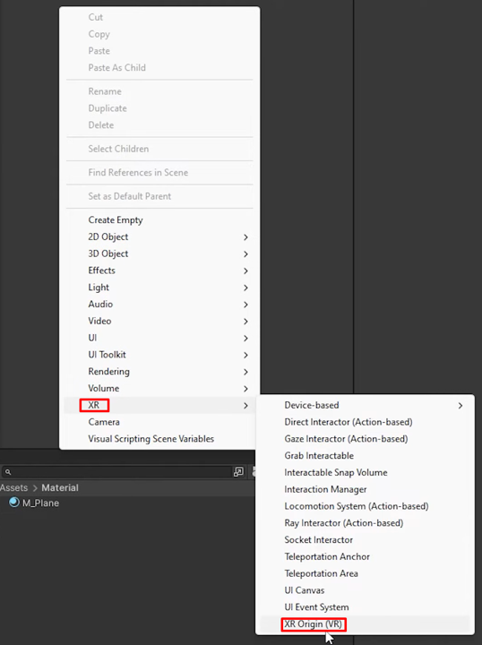

I started these notes while following [Unity’s VR Development Pathway](https://learn.unity.com/pathway/vr-development). So far I have configured the required packages and created an XR Origin; device simulation and headset testing are still in progress.

## Materials
- XR headset; for Meta Quest, install Meta Horizon Link before connecting the headset to Unity.
- Unity (an LTS release is recommended)

## Basic Setup
### 1. Install the Required Packages
From the main menu, select **Window → Package Management → Package Manager**, then install and configure:
- [XR Plugin Management](https://docs.unity3d.com/Packages/com.unity.xr.management@4.5/manual/index.html)
- [XR Interaction Toolkit](https://docs.unity3d.com/Packages/com.unity.xr.interaction.toolkit@3.1/manual/index.html)
- [OpenXR Plugin](https://docs.unity3d.com/Packages/com.unity.xr.openxr@1.14/manual/index.html)
- [Universal Render Pipeline](https://docs.unity3d.com/6000.1/Documentation/Manual/urp/urp-introduction.html)

### 2. Create an XR Origin

In the Hierarchy, right-click and select **XR → XR Origin**.

### 3. Test the Scene
- Device Simulator testing is still in progress.
- Headset testing is still in progress.
