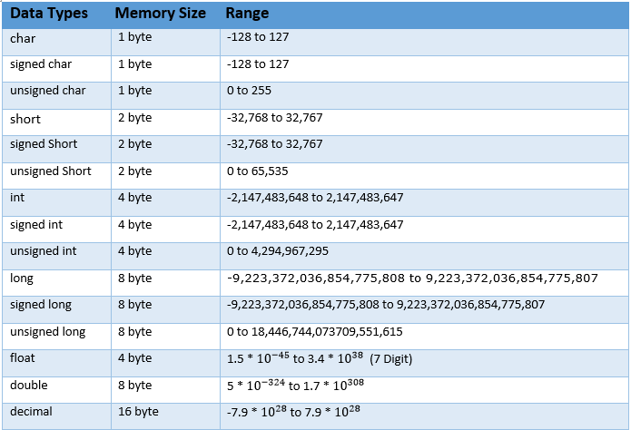

# C# Studying

This post is for my C# studying.

---

## 1. Variables and Data Types

### What is a variable?

A variable is a named space in memory that stores a value.
In C#, every variable must have a **type**, which determines:

* how much memory it uses
* what kind of values it can store

---

### Value Types 

Common value types include:


Example:
```csharp
int level = 100;
float speed = 3.14f;
bool isActive = true;
char grade = 'A';
```

Key point:
**The type decides what operations are allowed.**
You cannot treat an `int` like a `bool`, even if the value “looks similar”.

---

### Variable Initialization

Variables can be:

* initialized immediately
* declared first, assigned later

Example:
```csharp
int a1, a2, a3;
a1 = 10;

int b = 20;
```

If you forget to initialize, the compiler will usually stop you.
This is intentional: C# avoids “garbage values”.

---

## 2. Operators

### Arithmetic Operators

From the operator lecture :

* `+` addition
* `-` subtraction
* `*` multiplication
* `/` division
* `%` remainder

Example:

```csharp
int num1 = 5;
int num2 = 2;

int sum = num1 + num2;   // 7
int mod = num1 % num2;   // 1
```

---

### Division and Casting 

If both operands are integers, **integer division happens**.

```csharp
int a = 5;
int b = 2;
float result = a / b;   // result = 2 (not 2.5)
```

Correct way:

```csharp
float result = (float)a / b; // 2.5
```

---

## 3. Conditional Statements

### if / else

Conditionals allow the program to choose a path.

```csharp
int num = 11;

if (num > 10)
{
    Debug.Log("num is greater than 10");
}
else
{
    Debug.Log("num is 10 or less");
}
```

Conditions must evaluate to `bool`.

---

### Logical Operators

* `&&` AND
* `||` OR

Example:

```csharp
if (num > 0 && num < 20)
{
    Debug.Log("num is between 1 and 19");
}
```

Important detail:
C# uses **short-circuit evaluation**.
The second condition may not be evaluated if the first already determines the result.

---

### switch and enum

Used when states are discrete and named.

```csharp
enum STATE
{
    NONE = 0,
    INIT, //1
    PLAY = 100, //100
    OVER, //101

}

private int num = 0;
    private STATE currentState = STATE.INIT;

switch(num)
{
    case 100:
        {
            Debug.Log("switch 100");
        }
        break;
    case 90:
        {
            Debug.Log("switch 90");
        }
        break;
    default:
        Debug.Log("switch default");
        break;
}
```

This appears in the later control-flow section.

---

## 4. Loops

### for loop

Used when the number of iterations is known.

```csharp
for (int i = 0; i < 5; i++)
{
    Debug.Log(i); // 0 1 2 3 4
}
```

---

### while / do-while

Used when the stopping condition is more important than the count.

Key difference:

* `while` checks first
* `do-while` runs at least once

```csharp
int num1 = 0;
while (num1 < 10)
{
    Console.WriteLine(num1);
    num1++;
}

int num2 = 0;
do
{
    Console.WriteLine(num2);
    num2++;
}
while (num2 < 5);
```

---

### break and continue

```csharp
for (int i = 0; i < 10; i++)
{
    if (i % 2 == 0) continue;
    if (i > 8) break;
    Debug.Log(i);
}
```


---

## 5. Arrays 

### Why arrays exist

Arrays store **multiple values of the same type** in one structure.

```csharp
int[] scores = { 90, 70, 50 };
```

Access by index:

```csharp
scores[0]; // 90
```

Looping is almost always required:

```csharp
for (int i = 0; i < scores.Length; i++)
{
    Debug.Log(scores[i]);
}
```

---

### 2D Arrays

Used when data has rows and columns.

```csharp
int[,] grid = new int[2, 3];
```

Access:

```csharp
grid[0, 1];
```

---

## 6. Methods (Functions)

### Why methods matter

Methods:
* reduce duplication
* make code readable
* isolate logic

Important rule:
**A method should do one thing.**
If it does more, it probably should be split.

---

### Example

```csharp
void Print()
{
    Debug.Log("Hello World");
}

int MaxInt()
{
    return int.MaxValue;
}

long Sum(int a, int b)
{
    return a + b;
}
```

---


