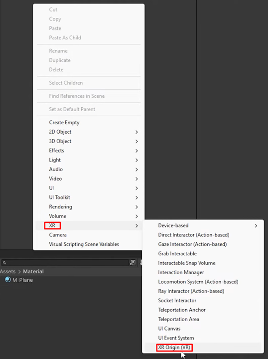

https://learn.unity.com/pathway/vr-development

## Materials
- XR HMD
    - If you use a meta quest, please install Meta Horizon Link in advance to connect your unity with HMD.
- Unity (recommend LTS version)

## Basic Setting
1. Download Packages

    - From the main menu, select **Window > Package Management > Package Manager** 
    > [XR Plugin Management](https://docs.unity3d.com/Packages/com.unity.xr.management@4.5/manual/index.html)
    > [XR Interaction Toolkit](https://docs.unity3d.com/Packages/com.unity.xr.interaction.toolkit@3.1/manual/index.html)
    > [OpenXR Plugin](https://docs.unity3d.com/Packages/com.unity.xr.openxr@1.14/manual/index.html)
    > [Universal Render Pipeline](https://docs.unity3d.com/6000.1/Documentation/Manual/urp/urp-introduction.html)

2. Make a XR Origin
    
    - From your hierarchy, click right and select **XR > XR Origin**

3. Run the app
    1) With the Device Simulator
        - 